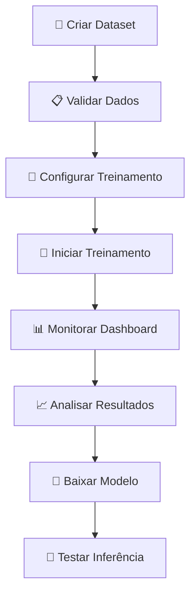

# 📖 Guia do Usuário

Este guia completo te ensina como usar todas as funcionalidades do YOLO Training Platform, desde a criação do primeiro dataset até o treinamento avançado de modelos.

## 🎯 **Visão Geral do Fluxo de Trabalho**



## 📁 **Parte 1: Gerenciando Datasets**

### 🆕 **Criando um Novo Dataset**

1. **Acesse a página inicial** → Clique em **"Criar Dataset"**
2. **Preencha as informações básicas:**
   - **Nome**: Ex: "Detecção de Carros"
   - **Descrição**: Ex: "Dataset para detectar carros em rodovias"
   - **Classes**: Ex: "carro, caminhao, moto"

3. **Estrutura de arquivos esperada:**
```
meu-dataset/
├── images/
│   ├── train/           # Imagens de treinamento
│   │   ├── img1.jpg
│   │   ├── img2.jpg
│   │   └── ...
│   ├── val/             # Imagens de validação  
│   │   ├── img10.jpg
│   │   └── ...
│   └── test/            # Imagens de teste (opcional)
└── labels/
    ├── train/           # Labels formato YOLO (.txt)
    │   ├── img1.txt
    │   ├── img2.txt  
    │   └── ...
    └── val/
        ├── img10.txt
        └── ...
```

### 📝 **Formato das Labels YOLO**

Cada arquivo `.txt` deve ter uma linha por objeto:
```
class_id center_x center_y width height
```

**Exemplo (img1.txt):**
```
0 0.5 0.3 0.4 0.6
1 0.2 0.7 0.3 0.4
```
- `0` = classe "carro", `1` = classe "caminhão"
- Valores normalizados entre 0 e 1
- `center_x, center_y` = centro do objeto
- `width, height` = dimensões do objeto

### 📤 **Upload de Dataset**

1. **Prepare os arquivos** em formato ZIP
2. **Faça upload** via interface web
3. **Aguarde validação** automática
4. **Verifique estatísticas**:
   - Total de imagens
   - Distribuição por classe
   - Divisão train/val/test

### ✅ **Validação Automática**

O sistema verifica automaticamente:
- ✅ Estrutura de pastas correta
- ✅ Correspondência imagem ↔ label  
- ✅ Formato das annotations
- ✅ Classes válidas
- ❌ Arquivos corrompidos
- ❌ Labels malformadas

## 🎯 **Parte 2: Configurando Treinamento**

### 🚀 **Iniciar Novo Treinamento**

1. **Vá para "Treinamento"** no menu principal
2. **Selecione o dataset** criado anteriormente
3. **Configure os parâmetros:**

#### 🔧 **Parâmetros Básicos**
- **Nome do Treinamento**: Ex: "Carros-v1.0"
- **Dataset**: Selecione da lista
- **Modelo Base**: 
  - 🏃 **YOLOv8n**: Mais rápido (6.2M parâmetros)
  - ⚡ **YOLOv8s**: Equilibrado (11.2M parâmetros)
  - 🎯 **YOLOv8m**: Recomendado (25.9M parâmetros)
  - 🔍 **YOLOv8l**: Alta precisão (43.7M parâmetros)
  - 🏆 **YOLOv8x**: Máxima precisão (68.2M parâmetros)

#### ⚙️ **Parâmetros Avançados**
- **Épocas**: 100 (padrão) - quantas vezes treinar no dataset completo
- **Batch Size**: 16 (padrão) - imagens processadas simultaneamente
- **Tamanho da Imagem**: 640 (padrão) - redimensionamento
- **Learning Rate**: 0.01 (padrão) - velocidade de aprendizado
- **Patience**: 50 (padrão) - épocas sem melhoria para parar

#### 💡 **Dicas de Configuração**

**Para datasets pequenos (< 1000 imagens):**
- Épocas: 200-300
- Batch Size: 8-16  
- Modelo: YOLOv8n ou YOLOv8s

**Para datasets médios (1000-10000 imagens):**
- Épocas: 100-200
- Batch Size: 16-32
- Modelo: YOLOv8m (recomendado)

**Para datasets grandes (> 10000 imagens):**
- Épocas: 50-100
- Batch Size: 32-64
- Modelo: YOLOv8l ou YOLOv8x

### 🚀 **Iniciando o Treinamento**

1. **Clique "Iniciar Treinamento"**
2. **Aguarde inicialização** (~30 segundos)
3. **Será redirecionado** para o dashboard

## 📊 **Parte 3: Dashboard de Monitoramento**

### 🎛️ **Interface Principal**

O dashboard mostra métricas em tempo real:

#### 📈 **Cards de Métricas**
- **Loss**: Erro do modelo (quanto menor, melhor)
  - Loss < 1.0 = Excelente
  - Loss 1.0-3.0 = Bom  
  - Loss > 3.0 = Precisa melhorar

- **mAP50**: Precisão média @ IoU=0.5 (quanto maior, melhor)
  - mAP50 > 0.8 = Excelente
  - mAP50 0.5-0.8 = Bom
  - mAP50 < 0.5 = Precisa melhorar

- **Precisão**: Detecções corretas / Total detectado
  - Precisão > 0.9 = Excelente
  - Precisão 0.7-0.9 = Bom
  - Precisão < 0.7 = Ajustar threshold

- **Recall**: Objetos encontrados / Total existente  
  - Recall > 0.9 = Excelente
  - Recall 0.7-0.9 = Bom
  - Recall < 0.7 = Modelo não encontra objetos

#### 📊 **Tabela de Progresso**
- Histórico de todas as épocas
- Tendência das métricas
- Tempo estimado restante

#### 🔴 **Indicadores de Status**
- 🟢 **Conectado**: Recebendo atualizações em tempo real
- 🔴 **Desconectado**: Verificar conexão
- ⏸️ **Pausado**: Treinamento pausado
- ✅ **Concluído**: Treinamento finalizado

### 🎮 **Controles do Treinamento**

- **⏸️ Pausar**: Interrompe temporariamente
- **▶️ Retomar**: Continua de onde parou  
- **⏹️ Parar**: Cancela permanentemente
- **📊 Detalhes**: Visualizar gráficos avançados

## 📈 **Parte 4: Análise de Resultados**

### 📊 **Página de Detalhes**

Clique em **"Ver Detalhes"** para análises avançadas:

#### 📈 **Gráficos Interativos**
- **Loss ao Longo do Tempo**: Tendência de melhoria
- **mAP Progressivo**: Evolução da precisão
- **Curvas de Validação**: Comparação train vs validation

#### 🖼️ **Visualizações YOLO**
- **Curva Precisão-Recall**: Performance por classe
- **Curva F1**: Ponto ótimo de threshold
- **Matriz de Confusão**: Erros por classe
- **Batch de Treinamento**: Visualização das imagens usadas
- **Batch de Validação**: Predições vs ground truth

### 📋 **Interpretando Métricas**

#### 🎯 **Loss (Função de Perda)**
```
Epoch 1: Loss = 5.2    # Alto no início  
Epoch 50: Loss = 2.1   # Melhorando
Epoch 100: Loss = 0.8  # Bom resultado
```
- **Tendência descendente** = modelo aprendendo ✅
- **Oscilação constante** = learning rate muito alto ⚠️
- **Parada prematura** = possível overfitting 🚨

#### 🏹 **mAP50 (Mean Average Precision)**
```
mAP50 @ Epoch 100: 0.85  # 85% de precisão média
```
- **> 0.9**: Modelo excepcional 🏆
- **0.7-0.9**: Modelo bom para produção ✅  
- **0.5-0.7**: Modelo OK, pode melhorar ⚠️
- **< 0.5**: Modelo precisa de ajustes 🚨

### 💾 **Salvando e Exportando**

#### 📥 **Download do Modelo**
1. **Aguarde conclusão** do treinamento
2. **Clique "Baixar Modelo"**
3. **Formatos disponíveis**:
   - `.pt` - PyTorch nativo (recomendado)
   - `.onnx` - ONNX para produção
   - `.engine` - TensorRT (GPU otimizada)

#### 📊 **Exportar Métricas**
- **CSV**: Dados de todas as épocas
- **PNG**: Gráficos em alta resolução
- **JSON**: Configurações do treinamento

## 🧪 **Parte 5: Testando Modelos**

### 🖼️ **Inferência de Imagens**

1. **Vá para "Testes"** no menu
2. **Selecione o modelo** treinado
3. **Upload da imagem** para testar
4. **Ajuste parâmetros**:
   - **Confiança**: 0.5 (padrão) - threshold mínimo
   - **IoU**: 0.5 (padrão) - sobreposição máxima
5. **Visualize resultados** com bounding boxes

### 📊 **Métricas de Inferência**
- **Tempo de processamento**: ms por imagem
- **Objetos detectados**: quantidade e classes
- **Confiança média**: score das detecções
- **Throughput**: imagens por segundo

## 🔧 **Parte 6: Configurações Avançadas**

### 🎛️ **Parâmetros de Treinamento**

#### 📊 **Data Augmentation**
```yaml
# Configurações automáticas aplicadas:
hsv_h: 0.015          # Variação de matiz
hsv_s: 0.7            # Variação de saturação  
hsv_v: 0.4            # Variação de brilho
degrees: 0.0          # Rotação (desabilitada por padrão)
translate: 0.1        # Translação
scale: 0.5            # Escala
shear: 0.0            # Cisalhamento
perspective: 0.0      # Perspectiva
flipud: 0.0           # Flip vertical
fliplr: 0.5           # Flip horizontal (50% chance)
mosaic: 1.0           # Mosaic augmentation
mixup: 0.0            # Mixup augmentation
```

#### ⚡ **Otimizações de Performance**
- **Mixed Precision**: FP16 automático se suportado
- **Multi-GPU**: Detecção automática de GPUs disponíveis
- **Batch Size Dinâmico**: Ajuste automático conforme RAM/VRAM
- **Workers**: CPU cores - 1 para carregamento de dados

### 🔍 **Monitoramento Avançado**

#### 📊 **Early Stopping**
```
Patience configurada: 50 épocas
Época 75: mAP50 não melhorou por 50 épocas consecutivas
→ Treinamento pausado automaticamente
→ Melhor modelo salvo (Época 25: mAP50 = 0.89)
```

#### 📈 **Learning Rate Scheduler**
```
Início: lr = 0.01
Época 30: lr = 0.005     # Redução automática
Época 60: lr = 0.001     # Segunda redução  
Época 90: lr = 0.0005    # Terceira redução
```

## 🚨 **Solução de Problemas Comuns**

### ❌ **Treinamento não inicia**
```
Possíveis causas:
1. Dataset não validado corretamente
2. Falta de espaço em disco
3. Porta não disponível para WebSocket
4. GPU com pouca memória

Soluções:
1. Verificar logs de validação
2. Liberar 2GB+ de espaço 
3. Fechar outras aplicações
4. Reduzir batch_size para 8 ou 4
```

### 📉 **Loss não diminui**
```
Sintomas:
- Loss oscila entre 3-5 sem melhorar
- mAP50 permanece baixo (< 0.3)

Soluções:
1. Verificar qualidade das annotations
2. Aumentar épocas (200-300)
3. Reduzir learning_rate (0.005)
4. Usar modelo maior (YOLOv8m → YOLOv8l)
5. Adicionar mais dados de treinamento
```

### 🔄 **Overfitting detectado**
```
Sintomas:  
- Train loss < 1.0, val loss > 2.0
- mAP treino > 0.9, mAP validação < 0.6

Soluções:
1. Aumentar dropout
2. Reduzir learning_rate
3. Mais data augmentation  
4. Early stopping mais agressivo (patience=30)
5. Adicionar mais dados de validação
```

### 💾 **Erro de memória GPU**
```
Erro: "CUDA out of memory"

Soluções imediatas:
1. Reduzir batch_size: 16 → 8 → 4
2. Usar imsize menor: 640 → 416  
3. Fechar outros programas usando GPU
4. Usar modelo menor: YOLOv8m → YOLOv8s

Soluções permanentes:
1. Upgrade de GPU (8GB+ VRAM recomendado)  
2. Usar CPU training (mais lento)
3. Treinamento distribuído em múltiplas GPUs
```

## 💡 **Dicas e Melhores Práticas**

### 📊 **Preparação de Dados**
- ✅ **Qualidade > Quantidade**: 1000 images bem anotadas > 5000 ruins
- ✅ **Balanceamento**: Similar número de exemplos por classe
- ✅ **Diversidade**: Diferentes ângulos, iluminação, backgrounds
- ✅ **Resolução**: Imagens originais 640x640+ pixels idealmente

### 🎯 **Configuração de Treinamento**
- ✅ **Comece pequeno**: YOLOv8n primeiro, depois escale
- ✅ **Baseline primeiro**: Treine 50 épocas, analise, depois ajuste  
- ✅ **Monitoramento**: Nunca deixe treinar sem supervisão
- ✅ **Checkpoints**: Save automático a cada 10 épocas

### 🚀 **Otimização de Performance**  
- ✅ **GPU**: Invista em boa GPU (RTX 3070+ recomendado)
- ✅ **RAM**: 16GB+ para datasets grandes
- ✅ **SSD**: Acelera carregamento de datasets
- ✅ **Cooling**: GPU não deve passar de 80°C

---

**🎯 Próximo passo**: [Dashboard e Métricas](Dashboard-e-Metricas.md)